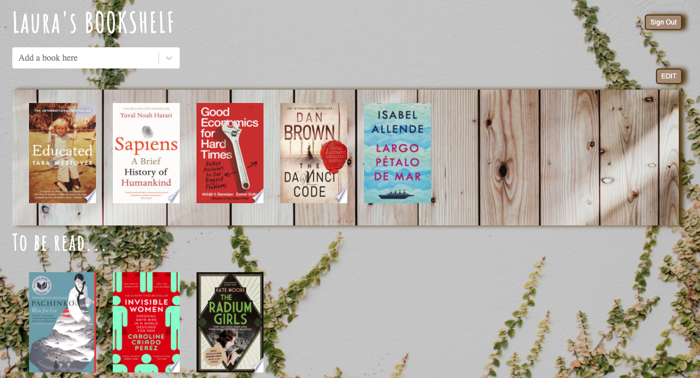

# My Personal Bookshelf

Full Stack App created with React, DynamoDB and AWS lambda to build your own personal bookshelf.

## Motivation

My personal bookshelf started as a side project to learn how to get data from external API's using React Hooks, but to provide a better UI experience I perfected the app by introducing other functionalities such as a Search Bar using `react-select` and Drag and Drop using `react-beautiful-dnd`.

To enable a full user experience I added a login and sign up page and then built a database to store and authenticate each user using a single-table design with DynamoDB. For authentication I used JSON Web Tokens and saved each user's session in a JWT to keep the user logged in.

## Technologies

- React v16.13.1
- DynamoDB
- AWS serverless

## Setup

Clone this repo `git clone https://github.com/lauracarballo/books-api` to your desktop and run `npm install` to install all the dependencies.

## To run the project

`npm start`

Runs the app in the development mode.
Open http://localhost:3000 to view it in the browser.

The page will reload if you make edits.
You will also see any lint errors in the console.

`npm run lambdas`

Runs the server in the development mode.

`npm run deploy-lambdas`

Deploys your entire service via CloudFormation. Run this command when you have made infrastructure changes (i.e., you edited serverless.yml).
